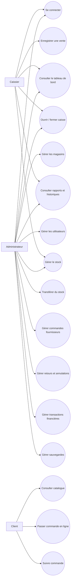
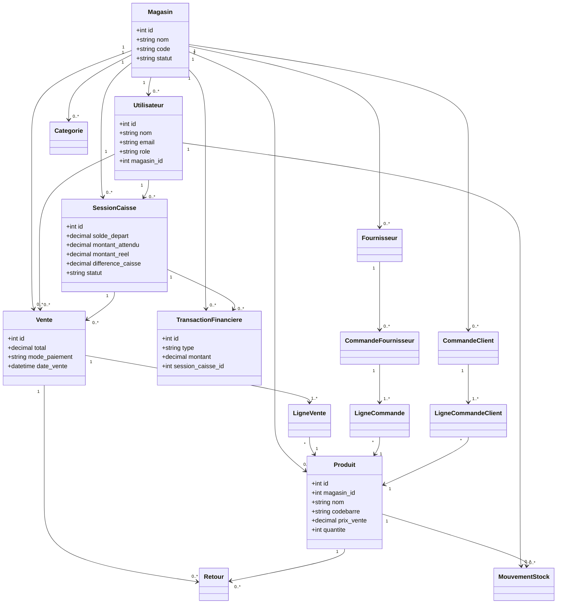

# Rapport de présentation du projet
## Système de gestion de supermarché multi-magasins

## 1. Introduction

Le projet est une application web de gestion destinée à un supermarché organisé en plusieurs magasins ou agences. Elle centralise les opérations de vente, de caisse, de stock, d'approvisionnement, de transferts entre magasins, de suivi financier et de supervision.

L'application fonctionne avec une base de données MariaDB et une interface web développée en PHP. Elle est conçue pour fonctionner avec plusieurs magasins dans une même installation.

Le système distingue principalement deux profils internes :

- **Administrateur** : supervision globale et accès aux magasins autorisés;
- **Caissier** : opérations de caisse et consultation limitées à son magasin affecté.

Le projet contient également un espace client en ligne permettant de consulter les produits disponibles, de constituer un panier et de passer une commande de retrait en magasin.

## 2. Objectif général

L'objectif principal est de fournir une solution unique permettant de :

- gérer plusieurs magasins;
- contrôler les utilisateurs et leurs droits;
- vendre rapidement à la caisse;
- suivre les espèces et les autres moyens de paiement;
- gérer les stocks magasin par magasin;
- enregistrer les mouvements de stock;
- commander auprès des fournisseurs;
- transférer les produits entre magasins;
- analyser les performances commerciales;
- sécuriser les opérations et les données;
- offrir un parcours de commande en ligne.

## 3. Problématique

Dans un supermarché possédant plusieurs agences, les informations sont souvent dispersées entre des cahiers, des fichiers Excel ou plusieurs logiciels. Cette organisation peut provoquer :

- des erreurs de stock;
- des difficultés de rapprochement de caisse;
- une mauvaise visibilité sur le chiffre d'affaires;
- des confusions entre magasins;
- un manque de traçabilité des opérations;
- des retards dans les décisions de gestion.

Le projet répond à cette problématique en regroupant les informations dans une base centralisée et en appliquant un périmètre par magasin.

## 4. Périmètre fonctionnel

### 4.1 Authentification et sécurité

Le système propose :

- connexion par adresse email et mot de passe;
- mots de passe stockés sous forme de hash sécurisé;
- gestion des comptes actifs, bloqués ou inactifs;
- déconnexion;
- protection CSRF des formulaires;
- contrôle des sessions et des appareils;
- journaux de sécurité;
- contrôle des accès selon le rôle;
- protection des fichiers téléversés;
- sauvegardes de la base de données.

Fichiers principaux : `login.php`, `logout.php`, `config.php`, `includes/fonctions.php`, `includes/security-monitor.php`.

### 4.2 Gestion des magasins

L'administrateur peut :

- ajouter un magasin;
- modifier les informations d'un magasin;
- activer ou désactiver un magasin;
- consulter le code, la ville, l'adresse et les coordonnées;
- sélectionner le magasin actif;
- consulter les statistiques d'un magasin.

Les codes des nouveaux magasins peuvent être générés automatiquement à partir des codes existants, par exemple `MAG001`, `MAG002`, etc.

Fichiers principaux : `settings.php`, `change_magasin.php`.

### 4.3 Gestion des utilisateurs

L'administrateur peut :

- créer un utilisateur;
- choisir le rôle `admin` ou `caissier`;
- affecter un caissier à un magasin;
- modifier un compte;
- désactiver ou supprimer un compte selon les règles de gestion;
- forcer la déconnexion d'un utilisateur.

Un caissier ne doit accéder qu'aux informations de son magasin.

Fichier principal : `utilisateurs.php`.

### 4.4 Tableau de bord

Le tableau de bord présente notamment :

- chiffre d'affaires;
- nombre de ventes;
- nombre de produits;
- produits en stock faible;
- employés;
- caisses ouvertes;
- produits expirés;
- dernières ventes;
- graphiques de performance;
- comparaison des magasins pour l'administrateur.

Le magasin affiché dépend du magasin actif. L'administrateur peut consulter un magasin précis, tandis que le caissier reste limité à son magasin.

Fichiers principaux : `dashboard.php`, `dashboard_pdf.php`.

### 4.5 Ouverture et fermeture de caisse

Le caissier ouvre une session avec :

- le montant initial;
- le reste de la veille;
- le solde de départ.

Pendant la session, le système suit :

- les ventes;
- les espèces réellement encaissées;
- les recettes financières;
- les dépenses financières;
- le montant attendu;
- le montant réellement compté;
- la différence de caisse.

La formule de contrôle est :

`Montant attendu = Solde de départ + Espèces des ventes + Recettes - Dépenses`

Une vente par carte ou par Mobile Money augmente le chiffre d'affaires, mais ne doit pas augmenter le montant liquide attendu dans le tiroir.

À la fermeture, le système compare le montant attendu avec le montant réel. En cas d'écart, la session est fermée en attente de contrôle administratif.

Fichiers principaux : `sessions_caisse.php`, `caisse.php`.

### 4.6 Ventes et tickets

Le caissier peut :

- rechercher un produit;
- scanner un code-barres;
- ajouter des produits au panier;
- contrôler les quantités disponibles;
- choisir le mode de paiement;
- calculer le total et la monnaie;
- enregistrer la vente dans une transaction SQL;
- imprimer ou consulter le ticket;
- vérifier un ticket.

Le stock est diminué au moment de la validation de la vente.

Fichiers principaux : `caisse.php`, `ticket_pdf.php`, `verify_ticket.php`, `vente_details_ajax.php`.

### 4.7 Produits et catégories

L'administrateur peut :

- créer un produit;
- modifier un produit;
- associer une catégorie;
- enregistrer le prix d'achat et le prix de vente;
- définir un seuil d'alerte;
- enregistrer une date de péremption;
- ajouter des photos;
- gérer le code-barres;
- consulter la quantité disponible.

Fichiers principaux : `produits.php`, `categories.php`, `barcode.php`.

### 4.8 Gestion du stock

Le système prend en charge :

- les entrées de stock;
- les sorties de stock;
- les ventes;
- les retours clients;
- les pertes;
- les corrections d'inventaire;
- les alertes de stock faible;
- l'historique par produit;
- le nettoyage des produits périmés.

Chaque mouvement doit être rattaché à un produit, un magasin et un utilisateur.

Fichiers principaux : `stock_mouvements.php`, `historiques_produits.php`, `nettoyage_stock.php`.

### 4.9 Transferts entre magasins

L'administrateur peut :

- choisir un magasin source;
- choisir un magasin destination;
- sélectionner les produits;
- indiquer les quantités;
- enregistrer le transfert;
- suivre son statut;
- réceptionner le transfert;
- consulter les quantités avant et après transfert.

Le système diminue le stock du magasin source et augmente le stock du magasin destination après réception.

Fichier principal : `transferts-stock.php`.

### 4.10 Fournisseurs et commandes d'achat

Le système permet de :

- gérer les fournisseurs;
- créer une commande fournisseur;
- ajouter les produits commandés;
- enregistrer les quantités et prix d'achat;
- réceptionner une commande;
- augmenter le stock à la réception;
- suivre le statut de la commande.

Fichiers principaux : `fournisseurs.php`, `commandes.php`.

### 4.11 Retours et annulations

L'administrateur peut :

- rechercher une vente;
- contrôler les lignes vendues;
- enregistrer un retour;
- remettre la quantité en stock;
- empêcher le retour d'une quantité déjà entièrement retournée;
- annuler une vente selon les règles d'autorisation.

Fichiers principaux : `retours.php`, `annuler_vente.php`.

### 4.12 Transactions financières

Le système enregistre :

- les recettes;
- les dépenses;
- les catégories financières;
- les descriptions;
- le magasin concerné;
- la session de caisse concernée;
- l'utilisateur ayant saisi l'opération.

Ces informations sont utilisées pour calculer le solde de caisse.

Fichier principal : `transactions.php`.

### 4.13 Rapports et historiques

L'administrateur peut consulter :

- le chiffre d'affaires;
- le nombre de ventes;
- le panier moyen;
- les meilleurs produits;
- les meilleurs caissiers;
- les produits non vendus;
- les mouvements de stock;
- les historiques d'actions;
- les sessions de caisse;
- les exports CSV.

Les données doivent être filtrées par magasin pour un caissier et peuvent être consultées globalement ou magasin par magasin par l'administrateur.

Fichiers principaux : `rapports.php`, `historiques.php`, `ventes_historique.php`, `export.php`.

### 4.14 Espace client en ligne

L'espace public permet au client de :

- consulter le catalogue;
- filtrer par catégorie;
- rechercher un produit;
- voir le stock disponible;
- choisir un magasin de retrait;
- ajouter des produits au panier;
- créer un compte client;
- passer une commande;
- consulter ses commandes.

Fichiers principaux : `index.php`, `inscription_client.php`, `commandes_clients.php`, `mes_commandes.php`.

### 4.15 Sauvegardes

Le système comprend :

- création de sauvegardes;
- téléchargement;
- import;
- restauration;
- journal des sauvegardes;
- paramètres de sauvegarde;
- sauvegarde automatique.

Fichiers principaux : `backup.php` et le dossier `backups/`.

## 5. Acteurs du système

### Administrateur

L'administrateur est responsable de la supervision générale. Il peut :

- gérer tous les magasins;
- gérer les utilisateurs;
- consulter les ventes et stocks;
- consulter les rapports;
- gérer les fournisseurs et commandes;
- gérer les transferts;
- contrôler les retours et annulations;
- valider les fermetures de caisse;
- gérer les paramètres;
- gérer les sauvegardes;
- consulter les journaux de sécurité.

### Caissier

Le caissier est responsable des opérations quotidiennes de son magasin. Il peut :

- ouvrir sa caisse;
- vendre les produits disponibles;
- imprimer les tickets;
- consulter ses opérations;
- fermer sa caisse;
- consulter les informations autorisées de son magasin;
- modifier son propre profil.

Le caissier ne doit pas :

- consulter les autres magasins;
- modifier les paramètres globaux;
- gérer les utilisateurs;
- modifier les droits;
- consulter les données financières d'un autre magasin;
- effectuer des transferts non autorisés.

### Client

Le client utilise l'espace en ligne. Il peut :

- consulter les produits;
- choisir un magasin;
- passer une commande;
- suivre ses commandes.

## 6. Cas d'utilisation principaux

### Cas 1 : Connexion

1. L'utilisateur ouvre la page de connexion.
2. Il saisit son email et son mot de passe.
3. Le système vérifie le compte et son statut.
4. Le système charge son rôle et son magasin.
5. L'utilisateur est redirigé vers son espace autorisé.

### Cas 2 : Ouverture de caisse

1. Le caissier ouvre la page de caisse.
2. Il saisit le montant initial et le reste de la veille.
3. Le système calcule le solde de départ.
4. Le système vérifie qu'il n'a pas déjà une caisse ouverte.
5. La session est créée avec le statut `ouverte`.

### Cas 3 : Vente en caisse

1. Le caissier recherche ou scanne un produit.
2. Le produit est ajouté au panier.
3. Le système vérifie le magasin et le stock.
4. Le caissier choisit le moyen de paiement.
5. Le système calcule le total et la monnaie.
6. La vente est enregistrée.
7. Le stock est diminué.
8. Le ticket est généré.

### Cas 4 : Fermeture de caisse

1. Le caissier demande la fermeture.
2. Il compte l'argent présent dans le tiroir.
3. Il saisit le montant réel.
4. Le système calcule le montant attendu de sa session.
5. Le système calcule l'écart.
6. La session est fermée.
7. Une différence éventuelle attend la validation de l'administrateur.

### Cas 5 : Transfert de stock

1. L'administrateur choisit la source et la destination.
2. Il choisit les produits et quantités.
3. Le système verrouille les stocks concernés.
4. Le stock source est diminué.
5. Le transfert est placé en attente.
6. La destination réceptionne le transfert.
7. Le stock destination est mis à jour.

### Cas 6 : Commande en ligne

1. Le client consulte le catalogue.
2. Il choisit les produits et les quantités.
3. Il choisit le magasin de retrait.
4. Le système vérifie le stock de ce magasin.
5. La commande et ses lignes sont enregistrées.
6. Le client peut consulter le statut de sa commande.

## 7. Diagramme de cas d'utilisation

## 8. Modèle de classes conceptuel

Le projet est développé en PHP procédural. Il ne contient donc pas un ensemble de classes métier PHP complet comme une application orientée objet. Pour la présentation UML, on peut néanmoins représenter les principales entités de la base de données comme des classes conceptuelles.

### Utilisateur

Attributs principaux :

- `id`
- `nom`
- `email`
- `mot_de_passe`
- `role`
- `magasin_id`
- `statut`

Responsabilités : se connecter, effectuer des opérations selon son rôle et son magasin.

### Magasin

Attributs principaux :

- `id`
- `nom`
- `code`
- `adresse`
- `ville`
- `pays`
- `statut`

Responsabilités : regrouper les produits, ventes, utilisateurs, caisses et transactions.

### Produit

Attributs principaux :

- `id`
- `magasin_id`
- `nom`
- `codebarre`
- `prix_achat`
- `prix_vente`
- `quantite`
- `seuil_alerte`
- `date_peremption`
- `categorie_id`

Responsabilités : représenter un article vendu et stocké dans un magasin.

### Categorie

Attributs principaux : `id`, `magasin_id`, `nom`.

Responsabilité : classer les produits.

### SessionCaisse

Attributs principaux :

- `id`
- `utilisateur_id`
- `magasin_id`
- `montant_initial`
- `reste_veille`
- `solde_depart`
- `total_ventes`
- `montant_attendu`
- `montant_reel`
- `difference_caisse`
- `statut`
- `statut_validation`

Responsabilité : suivre une période de caisse et son rapprochement.

### Vente

Attributs principaux :

- `id`
- `utilisateur_id`
- `magasin_id`
- `session_caisse_id`
- `total`
- `montant_recu`
- `monnaie`
- `mode_paiement`
- `date_vente`
- `tva`

Responsabilité : enregistrer une opération commerciale.

### LigneVente

Attributs principaux : `vente_id`, `produit_id`, `quantite`, `prix_unitaire`, `sous_total`.

Responsabilité : détailler les produits contenus dans une vente.

### MouvementStock

Attributs principaux :

- `produit_id`
- `magasin_id`
- `type`
- `quantite`
- `ancien_stock`
- `nouveau_stock`
- `utilisateur_id`
- `date_mouvement`

Responsabilité : conserver l'historique de chaque variation de stock.

### TransactionFinanciere

Attributs principaux :

- `id`
- `magasin_id`
- `session_caisse_id`
- `type`
- `montant`
- `categorie`
- `description`
- `utilisateur_id`

Responsabilité : enregistrer une recette ou une dépense rattachée à une caisse.

### Fournisseur

Attributs principaux : `id`, `magasin_id`, `nom`, `contact`, `telephone`, `email`, `adresse`.

### CommandeFournisseur

Attributs principaux : `id`, `fournisseur_id`, `magasin_id`, `utilisateur_id`, `statut`, `date_commande`.

### TransfertStock

Attributs principaux :

- `id`
- `reference`
- `magasin_source_id`
- `magasin_destination_id`
- `utilisateur_id`
- `reception_par`
- `statut`
- `date_transfert`
- `date_reception`

### Retour

Attributs principaux : `id`, `vente_id`, `produit_id`, `quantite`, `motif`, `date_retour`.

### CommandeClient

Attributs principaux :

- `id`
- `numero`
- `utilisateur_id`
- `magasin_id`
- `total`
- `statut`
- `date_commande`

## 9. Diagramme de classes conceptuel

## 10. Architecture technique

L'application utilise une architecture PHP procédurale organisée autour de fichiers par fonctionnalité.

### Couche configuration et sécurité

- `config.php` : connexion PDO, sessions, constantes et sécurité;
- `config-settings.php` : paramètres de l'application;
- `includes/fonctions.php` : authentification, rôles, CSRF, magasin actif et helpers;
- `includes/security-monitor.php` : surveillance des sessions et sécurité.

### Couche interface commune

- `includes/header.php` : en-tête, magasin actif, profil et notifications;
- `includes/sidebar.php` : navigation selon le rôle;
- `includes/footer.php` : pied de page et informations du magasin.

### Couche métier

Les pages PHP jouent à la fois le rôle de contrôleur, de logique métier et de vue. Cette organisation est simple à déployer mais peut devenir difficile à maintenir quand le nombre de fonctionnalités augmente.

### Base de données

La base MariaDB contient des tables pour :

- utilisateurs;
- magasins;
- produits;
- catégories;
- ventes et lignes de ventes;
- sessions de caisse;
- mouvements de stock;
- fournisseurs et commandes;
- transferts;
- retours;
- transactions financières;
- historiques et sécurité;
- commandes clients.

## 11. Scénario de démonstration conseillé

Pour présenter le projet, suivre cet ordre :

1. Se connecter comme administrateur.
2. Afficher le tableau de bord.
3. Sélectionner un magasin actif.
4. Montrer les produits et les niveaux de stock.
5. Créer ou consulter une session de caisse.
6. Se connecter comme caissier.
7. Ouvrir une caisse avec un montant initial.
8. Effectuer une vente en espèces.
9. Effectuer une vente par Mobile Money.
10. Montrer la différence entre chiffre d'affaires et espèces en caisse.
11. Fermer la caisse et afficher l'écart.
12. Revenir comme administrateur et valider la fermeture.
13. Montrer un transfert entre deux magasins.
14. Afficher les rapports et historiques filtrés.
15. Présenter l'espace client et une commande en ligne.

## 12. Texte prêt pour une présentation orale

### Introduction orale

« Bonjour à tous. Je vais vous présenter notre système de gestion de supermarché multi-magasins. Ce projet a été conçu pour centraliser les opérations commerciales et administratives d'une entreprise possédant plusieurs magasins ou agences. Il permet de gérer les utilisateurs, les ventes, les caisses, les produits, les stocks, les fournisseurs, les transferts et les rapports dans une seule application. »

### Présentation de la problématique

« Dans une organisation multi-magasins, chaque agence possède ses propres produits, son stock, ses ventes et ses caisses. Sans système centralisé, il devient difficile de connaître la situation réelle de chaque magasin et de comparer les performances. Notre solution répond à ce problème en rattachant les données à un magasin et en contrôlant l'accès selon le rôle de l'utilisateur. »

### Présentation des rôles

« Le système possède deux rôles internes principaux. L'administrateur supervise l'ensemble de l'activité. Il peut consulter les magasins, les ventes, les stocks, les rapports, les utilisateurs et les sauvegardes. Le caissier travaille uniquement dans le magasin qui lui est affecté. Il ouvre sa caisse, enregistre les ventes et ferme sa session. Cette séparation protège les données des autres magasins. »

### Présentation de la caisse

« La caisse fonctionne avec une session d'ouverture et une session de fermeture. À l'ouverture, le caissier indique le montant initial et le reste de la veille. Pendant la journée, les ventes et les mouvements financiers sont rattachés à cette session. À la fermeture, le système calcule le montant attendu et le compare au montant réellement compté. Les paiements en espèces sont distingués des paiements par carte ou Mobile Money afin de ne pas confondre le chiffre d'affaires avec l'argent présent dans le tiroir. »

### Présentation du stock

« Chaque produit appartient à un magasin et possède une quantité disponible, un prix de vente, un prix d'achat, un seuil d'alerte et éventuellement une date de péremption. Lorsqu'une vente est validée, le stock est diminué et un mouvement est enregistré. Le système permet également les entrées, sorties, retours, pertes, corrections d'inventaire et transferts entre magasins. »

### Présentation du multi-magasins

« Le multi-magasins est basé sur le magasin actif. L'administrateur peut sélectionner le magasin qu'il souhaite analyser et consulter ses données. Le caissier, lui, ne peut consulter et utiliser que le magasin qui lui est affecté. Cette règle est appliquée aux ventes, aux stocks, aux caisses, aux rapports et aux historiques. »

### Présentation de l'espace client

« En complément de l'espace interne, le projet propose une boutique en ligne. Le client peut consulter les produits disponibles, choisir un magasin de retrait, créer un panier et passer une commande. La commande est enregistrée avec le magasin choisi et les quantités sont contrôlées par rapport au stock disponible. »

### Conclusion orale

« Pour conclure, ce projet constitue une base complète pour la gestion d'un supermarché multi-magasins. Il couvre les opérations quotidiennes de vente et de stock, mais aussi la supervision administrative, la sécurité, les rapports et la commande en ligne. Les prochaines évolutions peuvent porter sur l'amélioration des tests, l'ajout de paiements en ligne, la gestion avancée des inventaires et le renforcement des contraintes de la base de données. »

## 13. Résultats attendus

Le système doit permettre :

- une réduction des erreurs de saisie;
- une meilleure connaissance du stock;
- un contrôle plus fiable des caisses;
- une séparation claire entre les magasins;
- une meilleure traçabilité;
- des décisions basées sur les rapports;
- une amélioration du service client.

## 14. Limites et améliorations futures

Pour une version professionnelle complète, les améliorations suivantes sont recommandées :

- ajouter des tests automatisés pour chaque rôle et chaque magasin;
- créer une vraie couche service/repository;
- ajouter des contraintes étrangères complètes;
- rendre les opérations historiques immuables;
- gérer les réceptions partielles de commandes;
- relier tous les retours aux remboursements financiers;
- ajouter un inventaire avec session et validation;
- ajouter la gestion des lots et dates de péremption avancées;
- sécuriser davantage la restauration des sauvegardes;
- utiliser un compte MySQL dédié en production;
- ajouter un système de permissions plus détaillé;
- ajouter une devise et une TVA configurables par magasin;
- mettre en place des sauvegardes chiffrées et testées;
- prévoir une synchronisation si les magasins doivent fonctionner sans connexion réseau.

## 15. Résumé en une phrase

**Le projet est une plateforme web centralisée qui permet à un supermarché multi-magasins de gérer ses utilisateurs, ventes, caisses, stocks, achats, transferts, finances, rapports et commandes clients, avec une séparation des accès entre l'administrateur et le caissier.**
